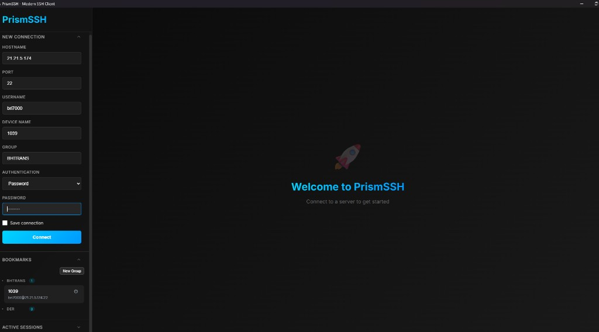
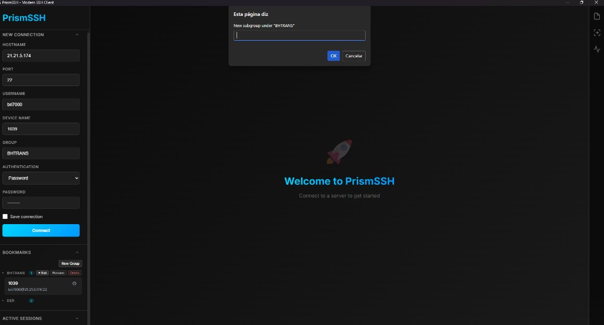

# PrismSSH 🔷

**A modern, all-in-one SSH client with beautiful UI and powerful features**

PrismSSH is a next-generation SSH client that combines terminal access, file management, and system monitoring in one elegant desktop application. Built with Python and modern web technologies, it offers a sleek alternative to traditional SSH clients.



## ✨ Features


### 🖥️ **Modern Terminal Experience**
- Multiple concurrent SSH sessions with tab management
- Crystal-clear terminal with customizable themes
- Real-time connection status monitoring
- Automatic reconnection on connection loss
- Smart logout detection (user commands + server disconnects)
  


### 📁 **Integrated SFTP Browser**
- Drag & drop file transfers
- Visual file browser with thumbnails
- Create directories and manage permissions
- Download/upload progress tracking
- Navigate remote filesystems with ease

### 📊 **Real-time System Monitor**
- Live CPU, memory, and disk usage
- Process manager with sorting and filtering
- Load average and system uptime
- Network interface monitoring
- Color-coded performance indicators


### 🔐 **Secure Connection Management**
- Encrypted password storage using industry-standard cryptography
- Support for SSH keys and password authentication
- Save and organize connection profiles
- Quick-connect to frequently used servers
- Automatic key management

### 📑 **Bookmarks: Device Name, grupos e subgrupos**
- Campos **Device Name** e **Group** no formulário **New Connection** etiquetam o perfil localmente (não mudam o handshake SSH).
- Nos **Bookmarks**, cada grupo (ex.: `BHTRANS`) mostra os dispositivos com **Device Name** em destaque e `user@host:porta` por baixo; **ações** (Editar, Conectar, Renomear, mover de grupo, Excluir) ficam só no menu **⚙** ao lado do cartão.
- Ao lado do nome de cada grupo há **+ Sub** (criar subgrupo), **Rename** e **Delete**. **+ Sub** abre uma caixa de texto para o nome do subgrupo dentro do grupo selecionado — o caminho hierárquico aparece nas ligações gravadas (ex.: `BHTRANS/Subpasta`).



### 🎨 **Beautiful Interface**
- Modern dark theme with glass-morphism effects
- Responsive design that adapts to any screen size
- Intuitive sidebar navigation
- Smooth animations and transitions
- Professional gradient accents

## 🚀 Getting Started

### Prerequisites

```bash
# Required Python packages
pip install webview paramiko cryptography
```

### Installation

1. **Clone the repository**
   ```bash
   git clone https://github.com/PhialsBasement/PrismSSH.git
   cd PrismSSH
   ```

2. **Install dependencies**
   ```bash
   pip install -r requirements.txt
   ```

3. **Run PrismSSH**
   ```bash
   python prismssh.py
   ```

### First Connection

1. Launch PrismSSH
2. Enter your server details in the "New Connection" panel
3. Choose authentication method (password or SSH key)
4. Click "Connect" and enjoy your modern SSH experience!

## 🛠️ Advanced Features

### Connection Profiles
- **Save Connections**: Store frequently used server details
- **Encrypted Storage**: Passwords are encrypted using PBKDF2 + AES
- **Quick Connect**: One-click access to saved servers
- **Bulk Management**: Import/export connection profiles

### System Monitoring
- **Real-time Metrics**: CPU, memory, disk usage updated every 5-30 seconds
- **Process Management**: View and sort running processes by CPU/memory
- **Custom Refresh Rates**: Choose update intervals (5s, 10s, 30s)
- **Performance Alerts**: Visual indicators for high resource usage

### File Management
- **SFTP Integration**: Browse remote files without leaving the terminal
- **Drag & Drop**: Easy file transfers between local and remote systems
- **Bulk Operations**: Upload/download multiple files simultaneously
- **Path Navigation**: Breadcrumb navigation and quick directory access

## 🔧 Configuration

PrismSSH stores its configuration in:
- **Linux/macOS**: `~/.prismssh/`
- **Windows**: `%USERPROFILE%\.prismssh\`

### Configuration Files
- `connections.json` - Saved connection profiles (encrypted passwords)
- `.key` - Encryption key for password storage

## 🎨 Customization

### Themes
The interface uses CSS custom properties for easy theming:

```css
:root {
  --primary-gradient: linear-gradient(135deg, #00d4ff 0%, #0099ff 100%);
  --background: #0a0a0a;
  --surface: rgba(255, 255, 255, 0.05);
  --text: #e0e0e0;
}
```

### Terminal Options
- Font family: Consolas, Courier New, monospace
- Font size: Configurable in terminal settings
- Color scheme: Customizable terminal themes
- Cursor style: Block, underline, or bar

## 🔒 Security

### Encryption
- **Password Storage**: AES encryption with PBKDF2 key derivation
- **Key Security**: 100,000 iterations, SHA-256 hashing
- **File Permissions**: Config files protected with 600 permissions
- **No Plain Text**: Sensitive data never stored unencrypted

### SSH Security
- **Host Key Verification**: Automatic host key management
- **Multiple Auth Methods**: Password, key-based, and agent authentication
- **Secure Channels**: All connections use SSH2 protocol
- **Session Isolation**: Each connection runs in isolated context

## 📱 Cross-Platform Support

| Platform | Status | Notes |
|----------|--------|-------|
| 🐧 Linux | ✅ Full Support | Native experience |
| 🍎 macOS | ✅ Full Support | Optimized for Retina displays |
| 🪟 Windows | ✅ Full Support | Windows 10+ recommended |

## 🤝 Contributing

We welcome contributions! Here's how to get started:

1. **Fork the repository**
2. **Create a feature branch**
   ```bash
   git checkout -b feature/amazing-feature
   ```
3. **Make your changes**
4. **Add tests** (if applicable)
5. **Commit your changes**
   ```bash
   git commit -m "Add amazing feature"
   ```
6. **Push to your branch**
   ```bash
   git push origin feature/amazing-feature
   ```
7. **Open a Pull Request**

### Development Setup

```bash
# Clone your fork
git clone https://github.com/PhialsBasement/PrismSSH.git
cd PrismSSH

# Install development dependencies
pip install -r requirements-dev.txt

# Run in development mode
python prismssh.py --debug
```

## 📋 Roadmap

### 🎯 Version 2.0
- [ ] Port forwarding management
- [ ] SSH tunnel visualization
- [ ] Custom themes marketplace
- [ ] Plugin system
- [ ] Cloud sync for connection profiles

### 🔮 Future Ideas
- [ ] Mobile companion app
- [ ] Team collaboration features
- [ ] Advanced scripting support
- [ ] Integration with cloud providers
- [ ] Multi-factor authentication

## 🐛 Troubleshooting

### Common Issues

**Connection Fails**
```bash
# Check SSH service is running
sudo systemctl status ssh

# Verify port is correct (usually 22)
nmap -p 22 your-server.com
```

**Slow Performance**
- Reduce system monitor refresh rate
- Close unused SSH sessions
- Check network latency

**File Transfer Issues**
- Verify SFTP is enabled on server
- Check file permissions
- Ensure sufficient disk space

### Debug Mode
Run with verbose logging:
```bash
python prismssh.py --verbose
```

## 📄 License

This project is licensed under the MIT License - see the [LICENSE](LICENSE) file for details.

## 🙏 Acknowledgments

- **[xterm.js](https://xtermjs.org/)** - Modern terminal emulator for the web
- **[Paramiko](https://www.paramiko.org/)** - Pure Python SSH library
- **[PyWebView](https://pywebview.flowrl.com/)** - Desktop GUI framework
- **[Inter Font](https://rsms.me/inter/)** - Beautiful typography
- **Icons** - Various open source icon libraries

## 📞 Support

- 🐛 **Bug Reports**: [GitHub Issues](https://github.com/PhialsBasement/PrismSSH/issues)
- 💡 **Feature Requests**: [Discussions](https://github.com/PhialsBasement/PrismSSH/discussions)
- 📧 **Email**: support@prismssh.dev

---

<div align="center">

**Made with ❤️ by the PrismSSH team**

[Website](https://prismssh.dev)

</div>
